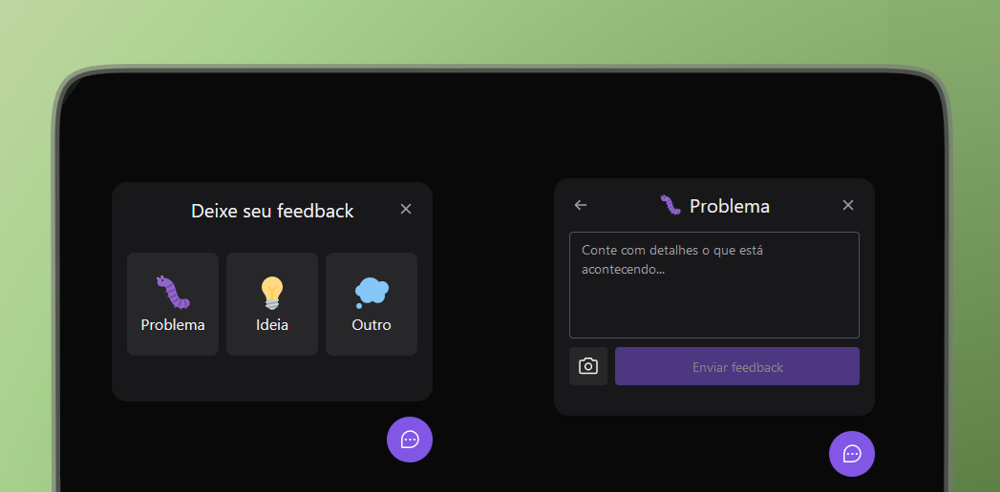

<h1 align="center">FeedGet</h1>

<br />
<p align="center"> 
   
	 
  	<a href="https://github.com/brunosduarte/feedget/commits/master"> 
   		 
 	</a> 
  	<a href="https://opensource.org/licenses/MIT"> 
   		 
  	</a> 
</p>

## 🗂 Contents

- 📋 [Project](#-project)
  - 🚀 [Technologies](#-technologies)
  - 📷 [Preview](#-preview)
- 📦 [Instalation](#-instalation)
- ⚖️ [License](#%EF%B8%8F-license)
- 📫 [Contact](#-contact)


## 📋 Project

FeedGet is a modular widget that you can put inside any other application, where is possible to send an email with a feedback message. It is a full-stack project developing web and mobile versions of the app. 


### 🚀 Technologies

[](https://react.dev)
[](https://react.dev)
[](https://nodejs.org)
[](https://expo.dev)
[](https://jestjs.io)
[](https://nodemailer.com)
[](https://prisma.io)
[](https://typescriptlang.org)
[](https://axios-http.com)
[](https://html2canvas.hertzen.com)
[](https://tailwindcss.com)
[](https://headlessui.com)

## 📷 Preview

##### 💻 frontend:

<p align="center"> 
  
</p>

## 📦 Instalation

To clone and run this application, you will need [Git][git], [NodeJS v18.17.1][nodejs] or higher + [npm v9.17.1][npm] or higher, and [PNPm 8.7.5][pnpm] installed on your computer. In your terminal, run:


```bash
# Cloning repo
$ git clone https://github.com/brunosduarte/feedget.git feedget
```

```bash
# Backend

# Go to the repository
$ cd server

# Install the dependencies
$ npm install

# Run the API
$ npm run dev

# Note: After running the command above, the API will be available at http://localhost:3333

```

```bash
# Frontend

# Got to the repository
$ cd web

# Install dependencies
$ npm install

# Execute
$ npm run dev
```

```bash
# Mobile

# Got to the repository
$ cd mobile

# Install dependencies
$ npm install

# Execute
$ npm run start
```


## ⚖️ License

This project is under license. [MIT](LICENSE).


## 📫 Contact

by [**Bruno Duarte**](https://www.linkedin.com/in/brunosduarte/) 🚀

[git]: https://git-scm.com
[nodejs]: https://nodejs.org/
[pnpm]: https://pnpm.io/pt/
[npm]: https://www.npmjs.com/
[expressjs]: https://expressjs.com
[html2canvas]: https://html2canvas.hertzen
[headlessui]: https://headlessui.com
[git]: https://git-scm.com
